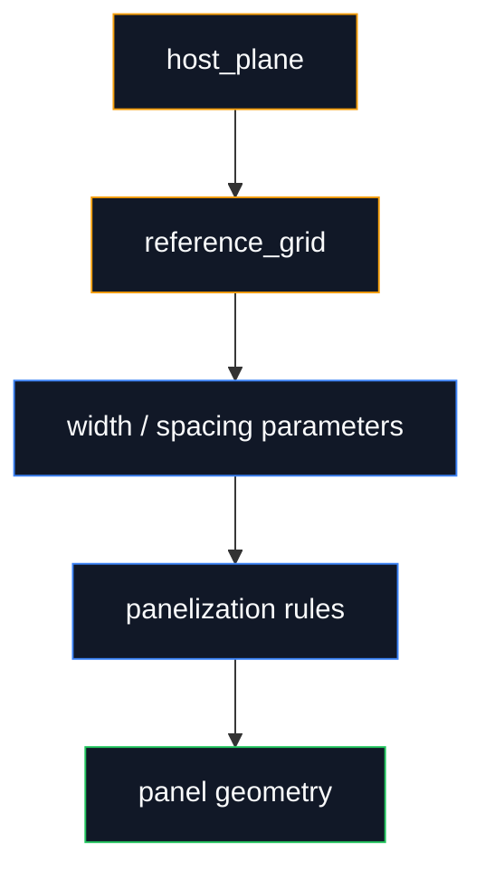

# Computational Design DAG

Use this command when the user intentionally wants a geometric, Grasshopper, Rhino, Revit, BIM, facade, structural, or parametric modeling request expanded into a computational design dependency graph.

Example:

```text
/geo-dag make me a unitized facade panel
```

Design request:

```text
$ARGUMENTS
```

## Purpose

Your job is not to write code yet. Your job is to turn a short design request into an explicit computational design DAG that an implementation agent can build from.

Short design requests usually hide:

- missing inputs
- missing units
- unclear coordinate frames
- direction words like inward, outward, left, front, upper, lower
- implied construction geometry
- visual selections
- edge/face choices
- output expectations

Expose those gaps through the DAG, assumptions, and named dependencies. Do not output hidden chain-of-thought. The visible artifact is the structured graph and implementation brief.

## Output Shape

Return these sections, in this order.

### 1. Interpreted Intent

One short paragraph:

- what geometry is being produced
- what the likely design goal is
- what the final output should contain

### 2. Inputs And Parameters

List likely inputs and parameters.

Format:

```text
INPUTS
- name (Type): description

PARAMETERS
- name (Type, units): default or assumed value

OUTPUTS
- name (Type): description
```

Mark invented values as `ASSUMED`.

### 3. DAG Nodes

Create build steps as nodes. Each node must have typed inputs and outputs.

Use this format:

```text
NODE: node_id
  LAYER: skeleton | muscle | skin
  IN: exact_name (Type), exact_name (Type)
  OP: canonical operation - short description
  OUT: exact_name (Type)
  STATUS: ready | assumed | blocked
  NOTES: concise edge cases or conventions
```

Rules:

- Every `IN` must refer to a top-level input/parameter or a previous node `OUT`.
- If a step needs visual judgment, set `STATUS: blocked` and add `REQUIRES: ...`.
- Prefer fewer strong nodes over many tiny nodes.
- Keep node count under 12 unless the procedure truly needs more.
- Make useful assumptions for common architectural/geometry defaults, and mark them.

### 4. Dependencies

Write edges as text:

```text
DEPENDENCIES
input_a -> node_a
node_a -> node_b
node_a, parameter_x -> node_c
node_b, node_c -> final_output
```

### 5. Mermaid DAG

Always include a Mermaid DAG. Keep it compact.

Use dark node fills and layer-colored borders:

- skeleton: orange
- muscle: blue
- skin: green
- blocked/unknown: red



If the graph has more than 15 nodes, collapse related nodes into sub-processes.

### 6. Missing Information

List only the gaps that block or materially affect implementation.

Use:

```text
MISSING / NEEDS DECISION
- [critical|important|nice]: exact missing thing
```

Examples:

- `[critical]: inward direction requires an interior reference point`
- `[important]: panel thickness is not specified`
- `[critical]: "trim the outside face" requires a face-selection rule`

### 7. Build-Ready Brief

Rewrite the original request into a concise implementation brief using the assumptions and names above.

This should be something an agent could immediately use to build a Grasshopper/Python implementation if the missing critical items are resolved.

## Layer Meaning

Think like a parametric Revit family or Grasshopper definition:

- `skeleton`: reference/control structure. Reference planes, levels, axes, base points, guide curves, grids, coordinate frames, anchors, datums, construction planes, and dependency topology. This is the thing everything else locks to.
- `muscle`: parameters, constraints, and procedural rules. Dimensions, offsets, formulas, sliders, equality constraints, spacing logic, profiles driven by parameters, transforms, arrays, conditionals, and the operations that make the skeleton move.
- `skin`: generated geometry and outputs. Solids, surfaces, panels, glass, mullions, caps, finishes, labels, debug geometry, and any final visible or exported result that wraps around the skeleton and muscle.

Do not treat skeleton/muscle/skin as merely "lines, then extrusions, then surfaces." The important distinction is control hierarchy:

- skeleton defines references
- muscle defines relationships and motion
- skin is what gets built from those controls

## Type Vocabulary

Use these types by default:

- Point
- Point[]
- Vector
- Plane
- Curve
- Curve[]
- Surface
- Brep
- Brep[]
- Mesh
- Number
- Boolean
- Transform
- Text

## Operation Vocabulary

Use simple canonical operations:

- Construct Plane
- Line Between Points
- Offset
- Trim
- Split
- Join
- CloseCurve
- Divide
- Project
- Intersect
- Extrude
- Loft
- Sweep
- Revolve
- Boolean Union
- Boolean Difference
- Cap
- Shell
- Move
- Copy
- Rotate
- Mirror
- Scale
- Array
- Bounding Box
- Deconstruct Brep

## Behavior

Be decisive. Make reasonable design/geometry assumptions and mark them. Do not ask questions unless a critical blocker makes the DAG impossible.

Keep the response compact. The DAG is the main artifact.
