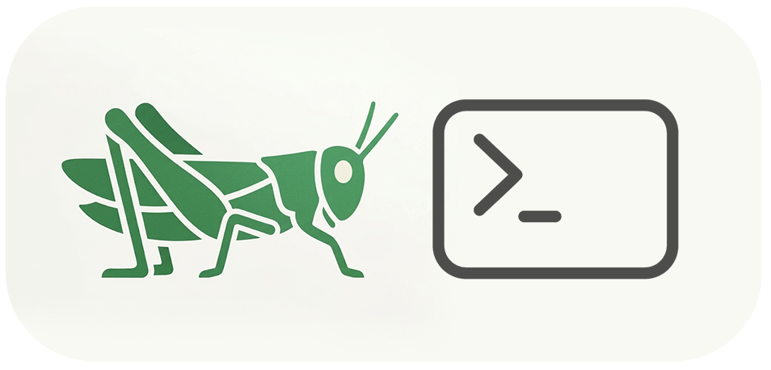

# GhCLI

GhCLI is a Claude Code-first bridge to a live Grasshopper canvas.

It is meant for agent-driven Grasshopper work, not as a normal human-facing CLI. Claude Code uses GhCLI to read the canvas, write Rhino 8 CPython 3 node files, batch nodes/sliders/panels/wires into one graph edit, solve, read debug output, and patch fast.

The purpose is to keep the model in a tight loop: use the model's baked-in geometry and coding intelligence first, then zap one compact payload to Grasshopper, inspect the solved evidence, patch, and repeat.

```text
status -> canvas.summary -> write .py + graph.json -> graph.apply -> debugAfter -> patch
```

## Claude Code Setup

Requirements: Windows, Rhino 8 with Grasshopper, and .NET SDK 8+.

1. Open this repo in Claude Code.
2. Run `/install`.
3. Restart Rhino if it was open.
4. Verify the bridge:

```powershell
src\GhCLI\bin\Debug\net8.0\GhCLI.exe status
```

Claude Code should start from:

- `CLAUDE.md`: full repo playbook.
- `AGENTS.md`: short agent entrypoint.

Available slash commands:

- `/install`: build and install the Grasshopper plugin.
- `/catalog <terms>`: search the local component catalog.
- `/catalog refresh`: rebuild the catalog if extracted source text exists locally.
- `/geo-dag <request>`: turn a short design request into a typed computational design DAG.

Available local skills:

- `.claude\skills\gh-cli`: CLI/schema/live-canvas edge cases.
- `.claude\skills\rhino-skill`: RhinoCommon, Grasshopper, Rhino.Inside, Eto, and geometry API edge cases.

Default agent behavior:

- Prefer `graph.apply`.
- Use Rhino 8 CPython 3: `"runtime": "cpython3"`.
- Keep Python in files.
- Add a `dbg` output to every Python node.
- Use `debugAfter` and verify from returned JSON.

## Fast Loop

GhCLI is built for short agent cycles:

1. Read `status` and `canvas.summary`.
2. Write CPython 3 source files in this repo.
3. Apply controls, Python nodes, panels, and wires with one `graph.apply`.
4. Read `debugAfter` in the response.
5. Patch and re-apply until the live canvas is correct.

Python source is file-based. Do not embed Python code in transaction JSON.

## CLI Commands

```powershell
src\GhCLI\bin\Debug\net8.0\GhCLI.exe status
src\GhCLI\bin\Debug\net8.0\GhCLI.exe canvas.summary --scope full
src\GhCLI\bin\Debug\net8.0\GhCLI.exe graph.apply --file samples\parametric-cube\graph.json
src\GhCLI\bin\Debug\net8.0\GhCLI.exe debug.read --node-id example_node
src\GhCLI\bin\Debug\net8.0\GhCLI.exe node.read --node-id example_node
src\GhCLI\bin\Debug\net8.0\GhCLI.exe solve.run
```

CLI stdout is always the final JSON response. Diagnostics go to stderr.

Default pipe name:

```text
ghcli.v1
```

Override with:

```powershell
$env:GHCLI_PIPE_NAME = "custom.pipe.name"
```

## `graph.apply`

`graph.apply` is the main write interface. It batches controls, Python nodes, panels, notes, wires, solve, and debug reads into one request.

Supported top-level arrays:

- `sliders`
- `toggles`
- `panels`
- `notes`
- `pythonNodes`
- `wires`

Minimal pattern:

```json
{
  "transactionId": "my-generator-001",
  "solveAfter": true,
  "debugAfter": ["my_generator"],
  "pythonNodes": [
    {
      "node_id": "my_generator",
      "nickname": "My Generator",
      "runtime": "cpython3",
      "file_path": "C:/absolute/path/to/samples/my-generator/script.py",
      "position": { "x": 360, "y": 120 },
      "inputs": [],
      "outputs": [
        { "name": "geometry", "typeName": "Brep", "access": "list" },
        { "name": "dbg", "typeName": "string", "access": "item" }
      ]
    }
  ]
}
```

Use `templates\graph-apply-basic.json` as the starter payload.

Python source is file-based. Do not embed Python code in transaction JSON.

## Repo Layout

- `src\GhCLI`: command-line client.
- `src\GhCLI.Plugin`: Grasshopper plugin and named-pipe server.
- `src\GhCLI.Protocol`: shared request/response contracts.
- `src\GhCLI.Core`: shared utilities.
- `samples`: runnable `script.py` + `graph.json` examples.
- `templates`: starter files for new graph definitions.
- `docs`: protocol/reference docs.
- `assets`: logo and demo media.
- `resources`: searchable data for agents and tools.
- `.claude`: Claude Code commands and skills.

## Resources

`resources` is not general documentation. It is lookup data.

Current resources:

- `resources\grasshopper-components\components.jsonl`: local inventory of installed Grasshopper components.
- `resources\grasshopper-components\manifest.json`: cache summary.
- `resources\grasshopper-components\schema.json`: component record shape.
- `resources\grasshopper-components\tools\`: helper scripts for catalog extraction/rebuilds.
- `resources\rhinocommon-samples\rhinocommon-samples-llms.txt`: compact links to official RhinoCommon samples.

Search resource files narrowly. Do not load full catalogs into model context.

Claude Code catalog helper:

```text
/catalog <search terms>
```

## Manual Fallback

Claude Code should normally run `/install`. Manual install is here only for troubleshooting or non-Claude setups.

Build:

```powershell
dotnet build GhCLI.sln
```

Build outputs:

- CLI: `src\GhCLI\bin\Debug\net8.0\GhCLI.exe`
- Plugin: `src\GhCLI.Plugin\bin\Debug\net7.0-windows\GhCLI.Plugin.gha`

The Grasshopper plugin targets `net7.0-windows` for Rhino compatibility. The CLI targets `net8.0`.

Copy the plugin build output from:

```text
src\GhCLI.Plugin\bin\Debug\net7.0-windows\
```

to:

```text
%APPDATA%\Grasshopper\Libraries\GhCLI\
```

Required files:

- `GhCLI.Plugin.gha`
- `GhCLI.Plugin.deps.json`
- `GhCLI.Core.dll`
- `GhCLI.Protocol.dll`

Restart Rhino after replacing plugin files.
